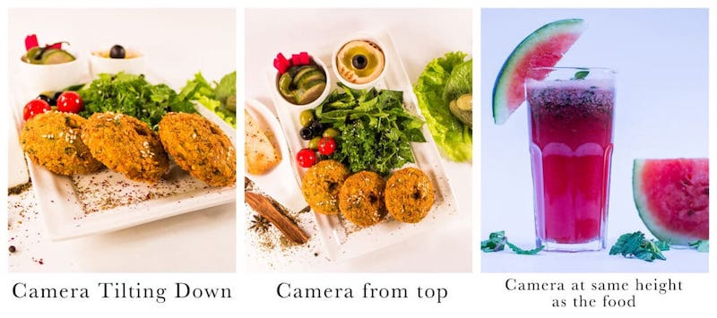
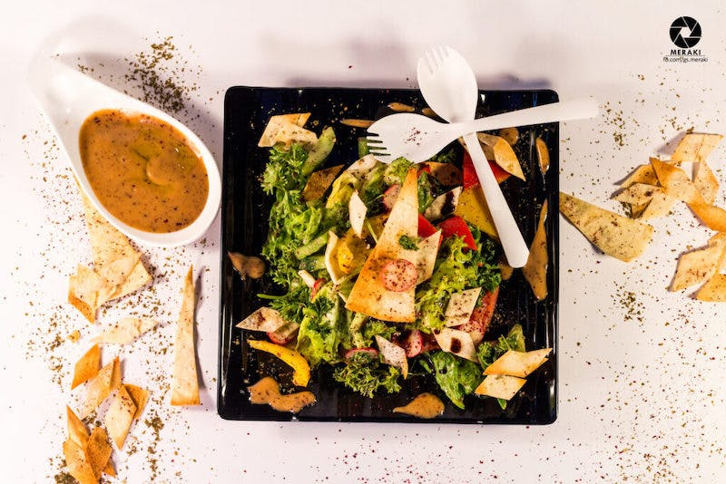
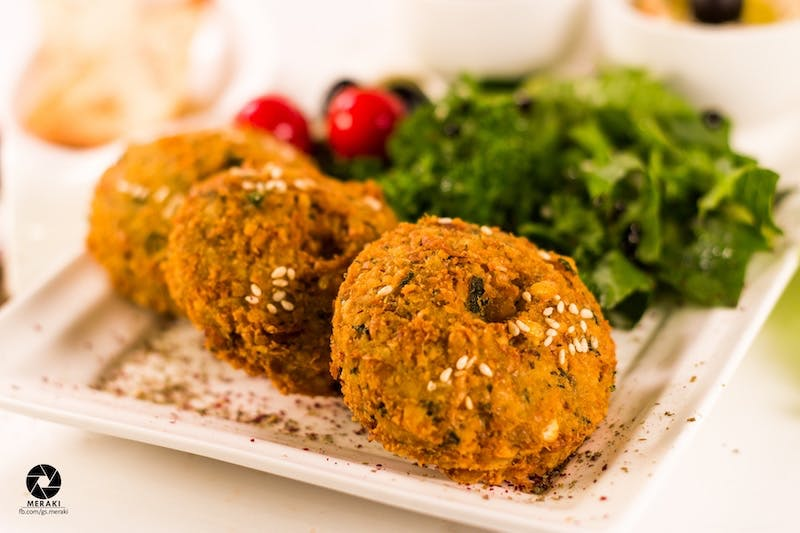
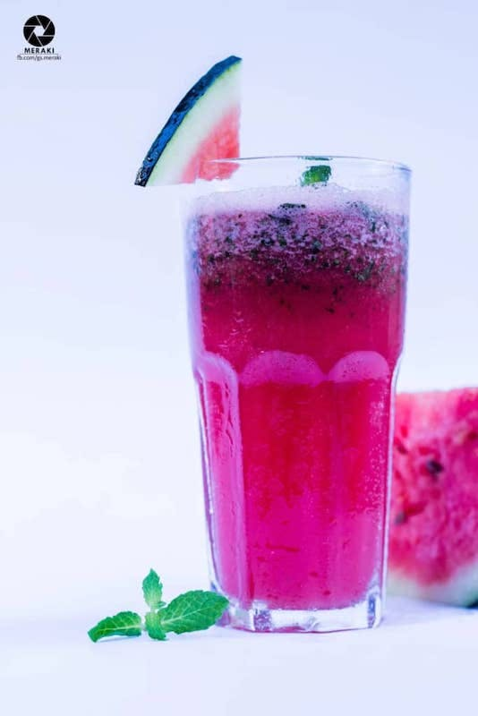

> I love photography, I love food, and I love traveling, and to put those three things together would just be the ultimate dream.  [Jamie Chung](https://www.quotemaster.org/author/Jamie+Chung) 

I am not an expert photographer, but I never give up on trying new ideas and angles in my photography. Capturing food and composition is challenging for me because I usually just like to put the food in the frame and quickly take the photo.

Every photographer has their their own style. A wedding photographer with soft-lit, glowing photos. A food photographer with hot, dark photos. It really just depends on what you like and are comfortable shooting. Sometimes it takes you years to understand your style. I would like to share some tips which I consider while capturing pics:

- Experiment With Different Heights: Check your object on different heights from the camera. You can place something cake stand or use glasses at different heights. Typically we use three angles when it comes to food photography.
- Consistent Portfolio: It is extremely important to have a consistent portfolio to land gigs, and it’s important to know that your portfolio should be a reflection of who you are.
- My Tripod: Best tip I can share with you, USE TRIPOD as much as you can. It gives stability to your final image, which leads you to less post-processing.
- Take Ideas: It is perfectly fine when you look for better photography ideas on the internet. I am not encouraging you to steal someone's idea but get inspired. I generally go on [pinterest](https://www.pinterest.com/) to refreshen-up my creativity and get inspired to create through my own lens.
- Learn to Balance Depth Of Field (DoF): A skill that will allow you to capture a combination of different moments with very different styles. It is important to learn how to balance your DoF with correct shutter speed and aperture settings.

Here are some photographs which I captured sometime back:

