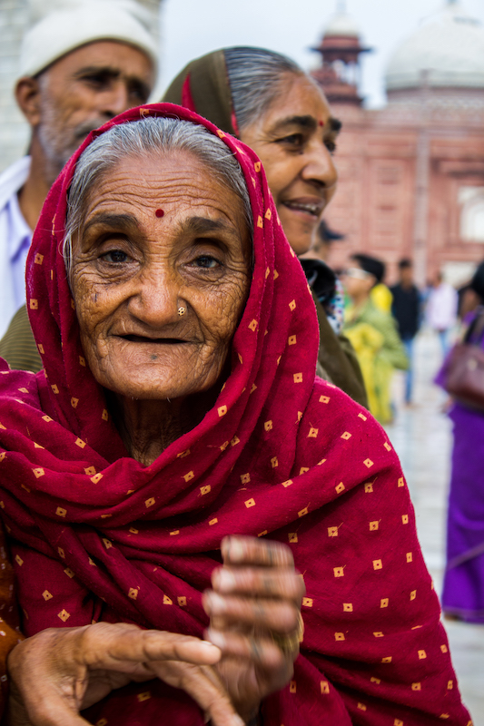
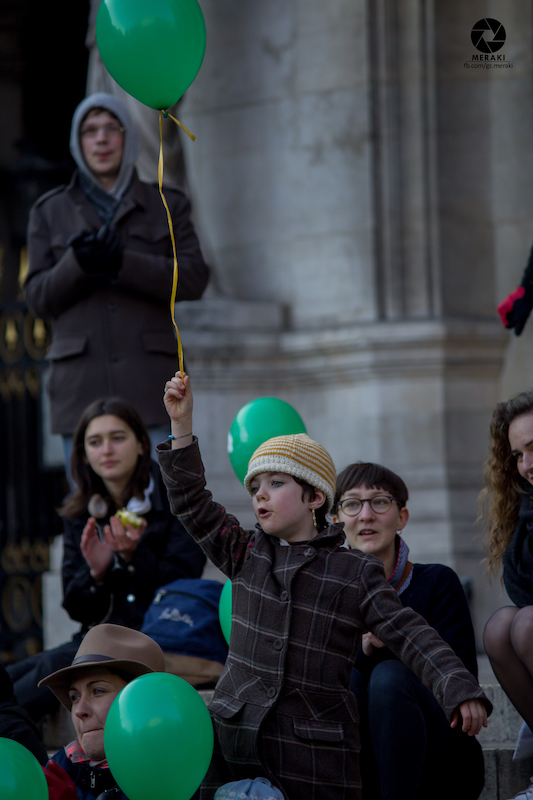
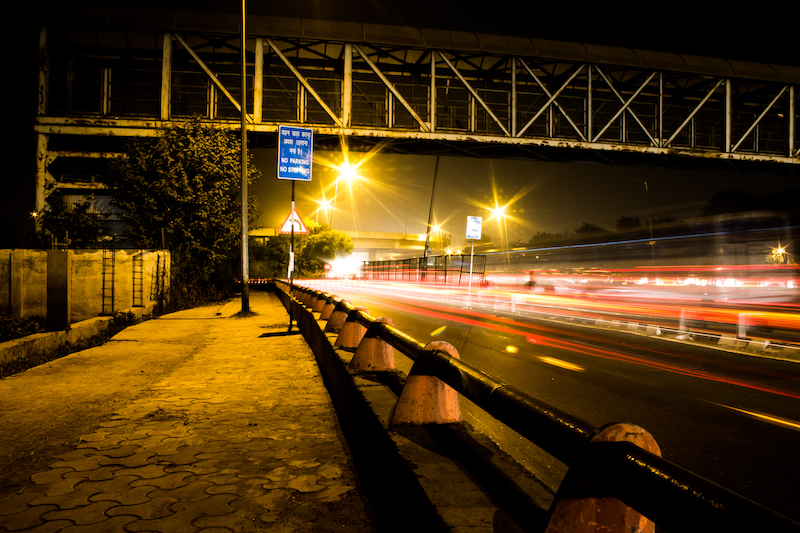
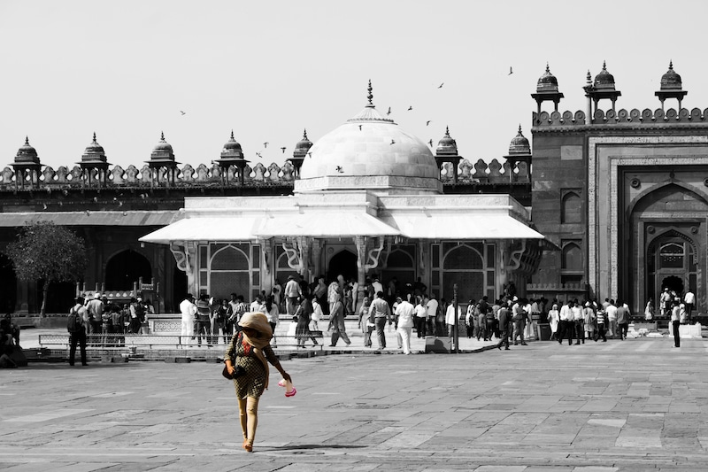
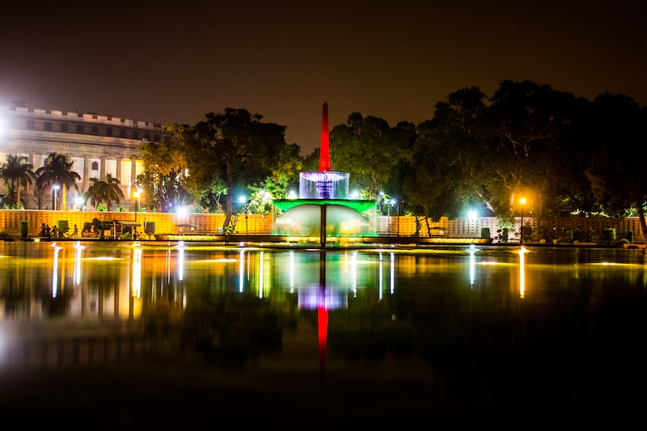
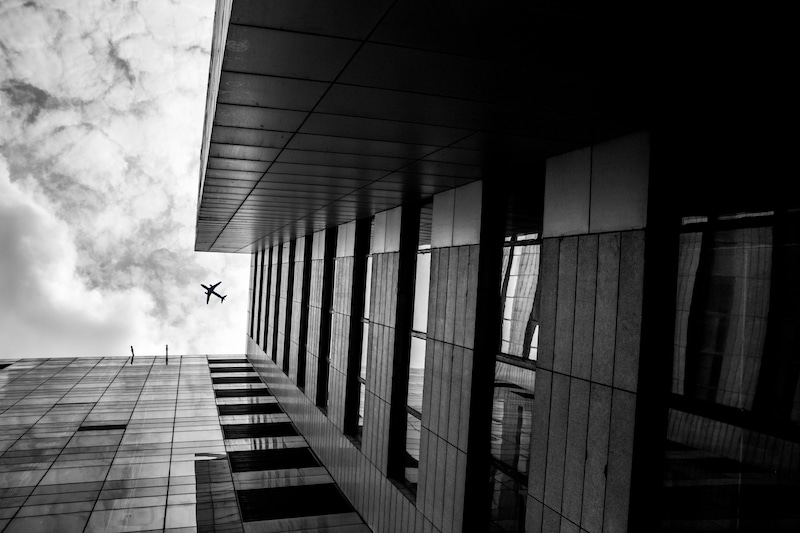

It is not easy to become a street photographer since every object is moving. Nevertheless, you still have a powerful weapon in your hands that can shoot anything with patience and the right time.

There are some tricks that I generally use in order to keep my photos laser-sharp even when they are moving.

**Eyes are important**: Most of the time you will notice people are hiding when you try to capture them. Emotions are very important when it comes to street photography, you get the opportunity to capture sadness, happiness, etc., try to capture as much as you can.

In addition, when you make eye contact it will make your photo more involving with your subject. “Be a shooter”, try to capture your subject as soon as you start looking at them because once they recognize being captured they will be distracted and your shot gets ruined.

**Stop Moving**: when you want to capture your picture laser-sharp without getting it blurred you have to keep yourself static.

You often see people moving around you but you have to choose your subject very carefully and just focus on that.

Make a stopping point and wait for some time. Don’t try to follow your subjects, but another way around. Let your subject get closer to you and then pull the trigger (I meant shutter). Try to capture your subject a couple of times so you can choose one of them.

**ISO settings**: DSLR or mirrorless cameras are generally good at high ISO. If you are in bright sunlight keep your ISO as less as it can. Some digital cameras have the option to bring the ISO to 50 or 100.

When it comes to night photography you can boost your ISO to 800, 1600, or 3200 (I generally don’t prefer). The more you increase more sharp photos you get. Careful, when I say sharp it may cause distortion (grains). So, you have to balance your ISO, by using high aperture lenses.

**Focus on Details**: It is not only you capture whatever you get on the street. Try to make a composition out of your shot. It can come with a selection of locations.

Be sure what you wanna shoot, bring your focus on what is in your mind. For example, “Today I wanna capture a lady with bag”, “Today I will only capture kids” etc. This way you can make your composition better.

Don’t miss little things while composing your shot. Expressions, hands, a single object in frame, clothes.

**Night lights / Artificial lights**: Nights come with darkness but it also brings artificial lights with them. Generally, when you are doing street photography try to avoid camera flash and use street lights or in some cases you see banners, glow signs; use them.

Compose your shot using as little as ISO you can. Try to find glowing store boards or street lamps.

**Architectures**: It is not important to capture streets with people. We often take street photography wrong, since we try to bring people into our shots. It is okay when you only capture empty streets.

You can rather categories your photograph in urban landscapes and street shots. It can have only empire state buildings, towers, construction sites without focusing on a single subject. Whereas, you can capture people in your street shots.

**Keep practicing**

Perfection never comes quickly, you have to keep practicing your photography skills. Keep going out to practice your strategy and ideas. Mark your calendar with ideas, type of photography.

I often go for photo walks with other photographers, and try to learn from other photographers. Share your work when you get a chance and ask for feedback.

Happy photography, keep clicking and sharing.