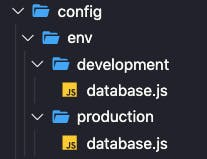

In this article, I will walk you through the Strapi CMS setup on your local machine followed by deploying it to Heroku.

## Prerequisites
- Install Node.js 12.x (recommended 14.x).
- Install [PostgreSQL](https://www.postgresql.org/) on your local machine. (Tip: I would suggest going with the [installer](https://www.postgresql.org/download/)).
- install Heroku on your local machine, Check the documentation [Here](https://devcenter.heroku.com/articles/heroku-cli).

## Setup local environment
If you want to use Heroko as a deployment server then I would suggest you choose PostgreSQL as a database option (however you have other options too).

### Local Postgre database setup

```sql
$ CREATE DATABASE strapi_db;
$ CREATE USER your_user_name WITH PASSWORD 'strong_password';
$ GRANT ALL PRIVILEGES ON DATABASE strapi_db TO your_user_name;
``` 
now you have a database setup on your local machine you are all set to install Strapi on your local machine.

### Create Strapi project
Create strapi project by using the following commands:
```sh
# Using yarn
$ yarn create strapi-app app

# Using npx
$ npx create-strapi-app app
```
> You can use the `--quickstart` parameter to go with the default setup which will create an SQLite database. Since we are going to deploy this on Heroku we shouldn't include this param

After running the above command you can start your local server by running `npm run develop` and it will ask you to create a local user. You can choose whatever username password you want because it will not gonna be deployed with your application.


## Setup Production Environment
Before sending it to Heroku we need to setup **production database** configurations. By default, Strapi comes with a default config that works for your local setup but we need to do a bit more to make it production-ready.

You will find the local database configuration here: `./config/database.js`. Now we need to create another similar set for the production database. Let's do some re-structuring of files.



Copy your `./config/database.js` file and put it into `./config/env/production/database.js`.

Now we have two `database.js` files. Please do the following changes to the `./config/env/production/database.js` file.
```sh
# you can now install the package to parse the database configs
$ npm i pg-connection-string
```

```js
const parse = require('pg-connection-string').parse;
const config = parse(process.env.DATABASE_URL);

module.exports = ({ env }) => ({
  defaultConnection: 'default',
  connections: {
    default: {
      connector: 'bookshelf',
      settings: {
        client: 'postgres',
        host: config.host,
        port: config.port,
        database: config.database,
        username: config.user,
        password: config.password,
        ssl: {
          rejectUnauthorized: false
        }
      },
      options: {
        ssl: true,
      },
    },
  },
});
```
In this `database.js` file we are accessing the `process.env` variable which will be available during the build process. Following will create a new environment variable in Heroku so it can be used during the deployment process.

This process of keeping configurations is secure since no one can see these values outside the Heroku logged user.

I believe you have Heroku already installed on your local if not you can follow the below commands:
```sh
$ brew tap heroku/brew && brew install heroku
```
Or go to [Heroku](https://devcenter.heroku.com/articles/heroku-cli#download-and-install) for instructions specific to your OS.

Once you have Heroku install, you can log in.
```sh
$ heroku login
```

Create a new Heroku project
```sh
$ heroku create heroku-app-name
```

Add the Heroku Postgres [add-on](https://elements.heroku.com/addons/heroku-postgresql):
```sh
$ heroku addons:create heroku-postgresql:hobby-dev --app heroku-app-name
```
> You can check your Postgres configurations by triggering the following command.

```sh
$ heroku config --app heroku-app-name
# you will get a similar kind of string
DATABASE_URL:  postgres://<username>:<password>@<hostname>:<port>/<database_name>
```
You don't have to worry to get these parameters since `pg-connection-string` will parse them for us.


## Time to Deploy 🤞
Deploy the project:
```sh
#connect heroku git repo
$ git init
$ git remote add heroku https://git.heroku.com/your-app-name.git

# add all your local changes to git
$ git add .

# commit your changes
$ git commit -m "initial commit"

# you need to push your changes to heroku repository
$ git push heroku master
```
Your application will be available here: `<your-app-name>.herokuapp.com/admin`

You did it 👏🏻

### Facing problems?
Sometimes it doesn't work on the first attempt, It would suggest following exactly the same steps I mentioned above. Still doesn't work, let's do this:
- Check if you can run the app on your local system.
- Check your environment variable on Heroku `heroku config`
- If everything is fine then try check logs with `heroku logs --tail`
- In case it doesn't work, leave your query in the comments or Google ;)

Thanks for reading.