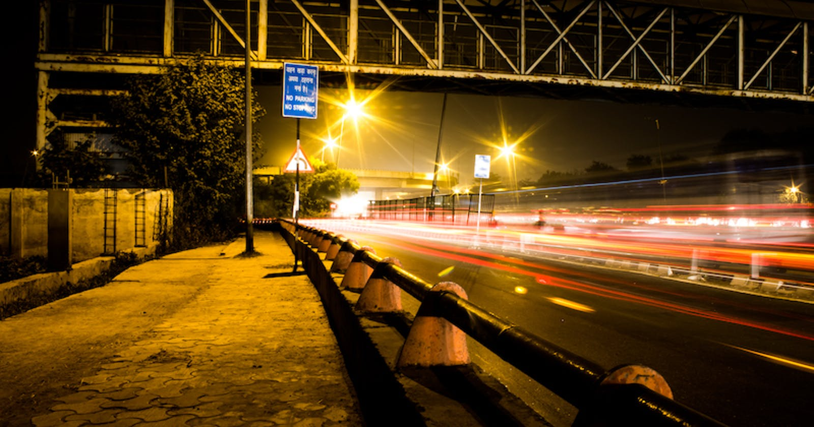

This category is very popular these days. Morden photographers often capture a sense of speed. This technique is normally used by landscape photographers, but you can use it for other stuff, too.

Look at the traffic lights in this photo I took near where I used to live in Delhi. I used a shutter speed of 30 seconds to turn the lights from sharp peaks into smooth, trailing lights. You still get a sense of motion, but it’s motion over time rather than action in a split second.

This is the hardest way to capture motion but the resulting pictures are often the best. There are a few things you need to bear in mind.

- Choose your shutter speed carefully and set it manually. The shutter speed required to freeze the road and let the traffic pass through your frame.
- Set low aperture so your photo shouldn’t get over-exposed.
- Note: Never hold your camera in your hands while capturing such pictures because it will cause other stable objects to blur. Use a good quality tripod and make sure it will not dislocate because of wind.
- Use a shutter releasing remote to avoid camera shake, if you can’t arrange one use the camera in-built timer feature.
- Now you are ready to capture motion blur pictures or long exposure.

Links to some good long exposure/motion blur pictures:

*Source: https://www.flickr.com/photos/stevacek/299323149/in/photostream/*

*Source: https://www.flickr.com/photos/magic_man/2132072683/in/photostream/*