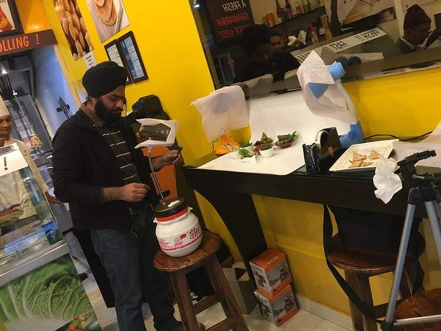
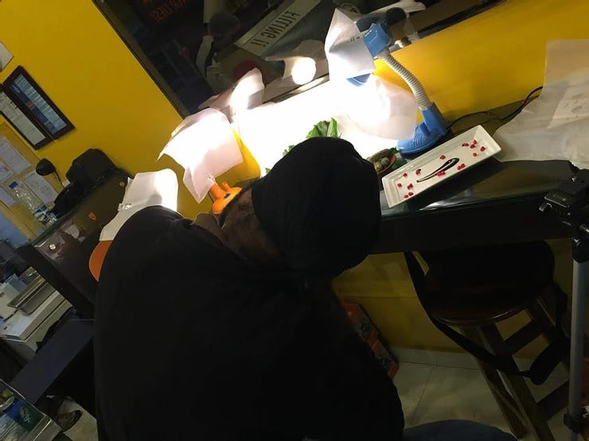
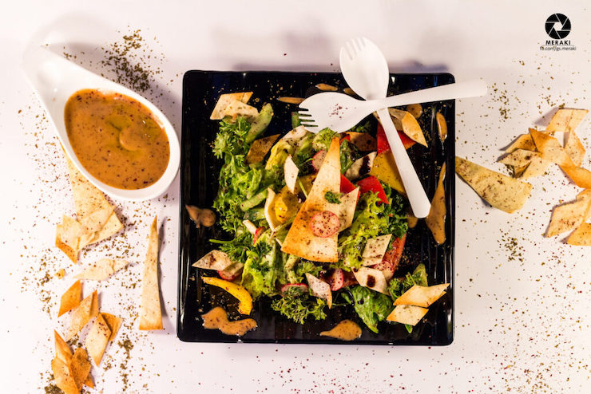
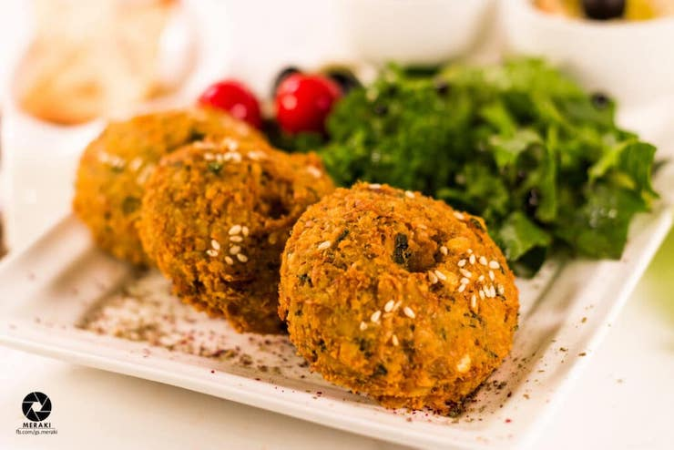
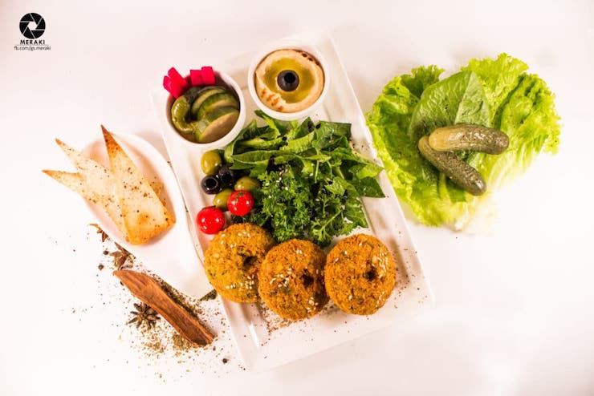

I would like to share with you my DIY (Do It Yourself) kind of food photography session for one of the famous restaurants based out of Gurugram (India).

It was the year 2016 when I requested by one of my close colleagues to conduct a photo shoot for his newly opened restaurant. Since it was my very first photo session for food I was a bit nervous. I was not even having the proper equipment, lights flash nothing. I know, not everyone can have such expensive equipment to entertain his/her hobby.

Then I decided to look for inexpensive ways to cover it. I watched so many YouTube videos to get inspiration for DIY photography.

The photoshoot started with borrowing a lens (Canon 50mm) from one of my colleagues and then I asked the restaurant owner to buy some table lamps (replacement for speed lights), and I started on it. After working in the office Mon-Friday I used to travel to Delhi-Gurugram on weekends to pursue my passion.

Since it was my very first photoshoot I wasn’t sure how to maintain food freshness in photographs. As I told you, YouTube was my friend to get ideas, I learned food prepared for a photoshoot sometimes is not meant to eat.

It doesn’t matter how great your recipe for dark chocolate cake is. If the image doesn’t pull the viewer in, you will have a hard time standing out in a medium that has literally changed the way food photography is seen.

*People are visual beings* These days people love to order food online. If your photographs are not doing justice to your food it becomes hard to sell your delicious food. Online consumers can only retain 10-20 percent of the information they read. When you add imagery or other visual content, that number goes up to 65%.

Finally, I would like to show you my final work which I managed to capture on those weekends:

