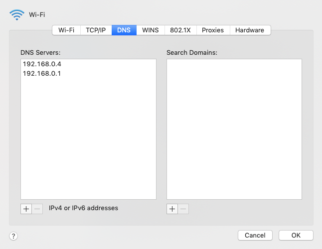

This article is my follow-up article to [Up and running with RaspberryPi with Docker](/up-and-running-with-raspberrypi-with-docker). In the previous article, I showed how you can configure docker and docker-compose on your RaspberryPi.

In this article, I will show how you can restrict external traffic from your RaspberryPi with [PiHole](https://hub.docker.com/r/pihole/pihole) using docker and docker-compose.

## <a name="installation" class="anchor" aria-hidden="true" href="#installation"><svg class="octicon octicon-link" viewBox="0 0 16 16" version="1.1" width="16" height="16" aria-hidden="true"><path fill-rule="evenodd" d="M7.775 3.275a.75.75 0 001.06 1.06l1.25-1.25a2 2 0 112.83 2.83l-2.5 2.5a2 2 0 01-2.83 0 .75.75 0 00-1.06 1.06 3.5 3.5 0 004.95 0l2.5-2.5a3.5 3.5 0 00-4.95-4.95l-1.25 1.25zm-4.69 9.64a2 2 0 010-2.83l2.5-2.5a2 2 0 012.83 0 .75.75 0 001.06-1.06 3.5 3.5 0 00-4.95 0l-2.5 2.5a3.5 3.5 0 004.95 4.95l1.25-1.25a.75.75 0 00-1.06-1.06l-1.25 1.25a2 2 0 01-2.83 0z"></path></svg></a> Installation

The first step to defining a place where you want to install PiHole. In my case, I am going to keep it under the `~` path.

```bash
$ cd ~
$ mkdir pihole
$ cd pihole
$ touch docker-compose.yml
```

Once you create the _docker-compose.yml_ file inside the _pihole_ directory, add the following code into it.

```bash
$ nano docker-compose.yml
```

```yml
version: "3"

services:
  pihole:
    container_name: pihole
    image: pihole/pihole:latest
    ports:
      - "53:53/tcp"
      - "53:53/udp"
      - "67:67/udp"
      - "80:80/tcp"
    environment:
      TZ: "America/Chicago"
      WEBPASSWORD: "strongPassword"
    volumes:
      - "./etc-pihole/:/etc/pihole/"
      - "./etc-dnsmasq.d/:/etc/dnsmasq.d/"
    cap_add:
      - NET_ADMIN
    restart: unless-stopped
```

After saving the _docker-compose.yml_ file, you can run the following command to bring your PiHole server up and running.

```bash
$ docker-compose up --detach
```

> Initial run will take some time since it will download the PiHole image from docker.

After a successful run, you can check PiHole instance is running on RaspberryPi as a docker service.

```bash
# Try following commands to check PiHole service

$ docker ps
# To check the list of running containers

$ docker images
# To check PiHole image
```

If you have static IP defined [configure in my previous article](/up-and-running-with-raspberrypi-with-docker#assign-static-ip) then you can access PiHole, at [http://192.168.0.4/admin](http://192.168.0.4/admin)

## <a name="configure-devices" class="anchor" aria-hidden="true" href="#configure-devices"><svg class="octicon octicon-link" viewBox="0 0 16 16" version="1.1" width="16" height="16" aria-hidden="true"><path fill-rule="evenodd" d="M7.775 3.275a.75.75 0 001.06 1.06l1.25-1.25a2 2 0 112.83 2.83l-2.5 2.5a2 2 0 01-2.83 0 .75.75 0 00-1.06 1.06 3.5 3.5 0 004.95 0l2.5-2.5a3.5 3.5 0 00-4.95-4.95l-1.25 1.25zm-4.69 9.64a2 2 0 010-2.83l2.5-2.5a2 2 0 012.83 0 .75.75 0 001.06-1.06 3.5 3.5 0 00-4.95 0l-2.5 2.5a3.5 3.5 0 004.95 4.95l1.25-1.25a.75.75 0 00-1.06-1.06l-1.25 1.25a2 2 0 01-2.83 0z"></path></svg></a> Configure devices

After the installation of PiHole now we need to map other devices to use PiHole as the default gateway. For that, you can go to the network/Wifi settings of your individual devices and add **192.168.0.4** IP address to the DNS list (should be on top). See the example below:


Thanks for following the tutorial, happy coding!
