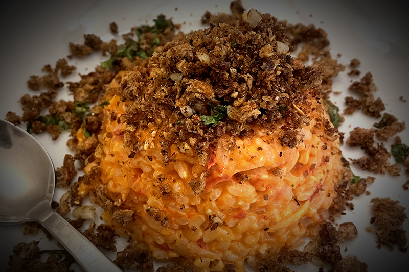

After eating countless risotto from several restaurants I thought to cook my own version. You generally eat *risotto ai funghi* but this my version has tomatoes in it. Let's start cooking.

## Ingredients

### Risotto
- 150g Arborio rice (Risotto rice)
- 100ml White wine
- 200g tin of chopped tomatoes
- 1 tbsp tomato puree
- 1 tbsp olive oil
- 1 small onion peeled and finely chopped
- 1-2 clove garlic peeled and minced
- 3 tbsp double (heavy) cream
- 4 tbsp grated parmesan cheese
- Good pinch of salt and black pepper

### Garlic Crumbs
- 3/4 tbsp butter
- 1/4 tsp salt
- 2 cloves garlic peeled and minced
- 4 tbsp breadcrumbs (dry)
- 1 tsp chopped parsley/cilantro
- 3 tbsp parmesan cheese

## Cooking Steps
- First make your **tomato based stock**. Place a tin of chopped tomatoes in a large jug with lukewarm water and tomato puree. Mix it well until you get slightly thinner version of tomato based stock.
- Soften a chopped onion and garlic in a pan with a little oil, then the **rice and wine**.
- Wait for the wine to almost fully absorb, then add the tomato stock a ladle at a time. Stir it regularly and ensure each ladle has almost fully absorbed before adding the next.
- Put lid on your pan and cook for 10 mins (to cook rice properly).
- Now add **cream** into risotto followed by parmesan and salt & pepper.
- Whilst the risotto is cooking, melt some butter in a small frying pan with salt and garlic, then add in breadcrumbs and brown, stirring often. Turn off the heat and stir in parsley/cilantro.

> Sprinkle breadcrumbs on risotto to serve.
