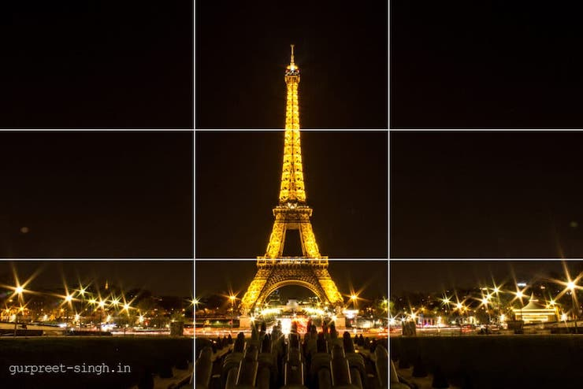
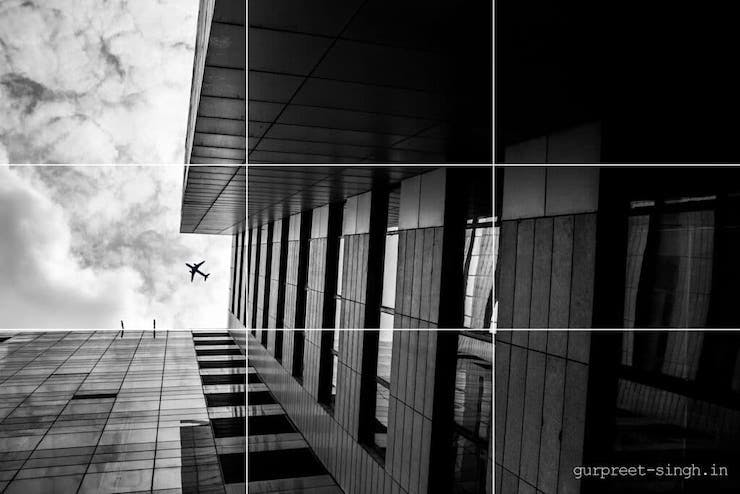
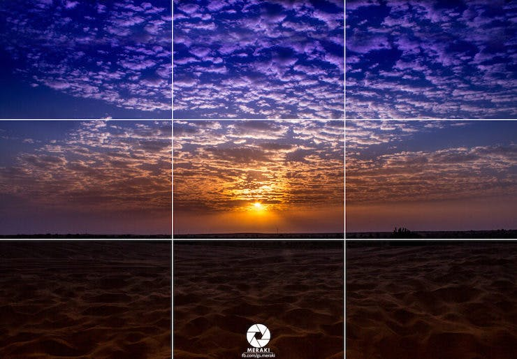

The most common rule of photography is known as the “rule of thirds”. With this technique, you divide your photo into 3 divisions horizontally and vertically, which means your subject is placed on intersection lines.

## What is the Rule of Thirds in Photography

This is a very commonly used technique to capture pictures, and very easy to learn. You can simply divide your object into thirds horizontally and vertically. Once you place your object between those lines or on intersection points you can click your picture. Some examples pictures that show the rule of thirds.

Sometimes photographers don’t even know about the rule of thirds and they take photos with the rule of approximate and photos become better.

## How to enable yourself?

Most of the latest cameras are having a grid option which can be turned on from settings. This feature is also available on mobile phones and can be enabled from settings.