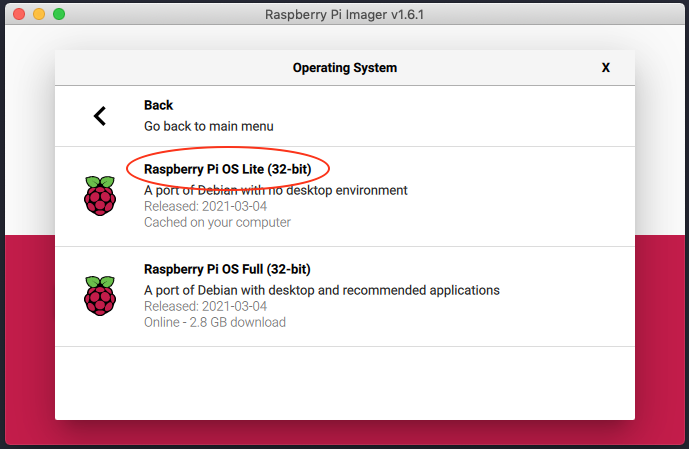

In this article, I will show you how to configure RaspberryPi with docker and docker-compose. I am personally using it for my local hone projects where I can run these projects without interfering RaspbianOS image.

## <a name="system-requirements" class="anchor" aria-hidden="true" href="#system-requirements"><svg class="octicon octicon-link" viewBox="0 0 16 16" version="1.1" width="16" height="16" aria-hidden="true"><path fill-rule="evenodd" d="M7.775 3.275a.75.75 0 001.06 1.06l1.25-1.25a2 2 0 112.83 2.83l-2.5 2.5a2 2 0 01-2.83 0 .75.75 0 00-1.06 1.06 3.5 3.5 0 004.95 0l2.5-2.5a3.5 3.5 0 00-4.95-4.95l-1.25 1.25zm-4.69 9.64a2 2 0 010-2.83l2.5-2.5a2 2 0 012.83 0 .75.75 0 001.06-1.06 3.5 3.5 0 00-4.95 0l-2.5 2.5a3.5 3.5 0 004.95 4.95l1.25-1.25a.75.75 0 00-1.06-1.06l-1.25 1.25a2 2 0 01-2.83 0z"></path></svg></a> System Requirements

- Raspberry Pi 4 (for better performance)
- 32GB memory card
- LAN cable to connect your RaspberryPi with local network

## <a name="installation" class="anchor" aria-hidden="true" href="#installation"><svg class="octicon octicon-link" viewBox="0 0 16 16" version="1.1" width="16" height="16" aria-hidden="true"><path fill-rule="evenodd" d="M7.775 3.275a.75.75 0 001.06 1.06l1.25-1.25a2 2 0 112.83 2.83l-2.5 2.5a2 2 0 01-2.83 0 .75.75 0 00-1.06 1.06 3.5 3.5 0 004.95 0l2.5-2.5a3.5 3.5 0 00-4.95-4.95l-1.25 1.25zm-4.69 9.64a2 2 0 010-2.83l2.5-2.5a2 2 0 012.83 0 .75.75 0 001.06-1.06 3.5 3.5 0 00-4.95 0l-2.5 2.5a3.5 3.5 0 004.95 4.95l1.25-1.25a.75.75 0 00-1.06-1.06l-1.25 1.25a2 2 0 01-2.83 0z"></path></svg></a> Installation

The first step is to install the Raspbian OS image on your memory card. I would suggest going with [RaspberryPi official](https://www.raspberrypi.org/software/) page to download the Raspberry Pi Imager. I recommend using this imager because it can directly fetch the latest OS image from RaspberryPi's website.



After installing it, you need to enable your RaspberryPi with `ssh`. Go to your SD card drive and create an `ssh` file by type the `touch ssh` command. This file will enable `ssh` so you can access it throughout your home network.

> It is advisable to update the app of the packages after initial installation.

```bash
# log into your RaspberryPi with default password: raspberry
$ ssh pi@ip-address-of-your-rpi

# update and upgrade all local packages
$ sudo apt-get update
$ sudo apt-get upgrade
```

## <a name="assign-static-ip" class="anchor" aria-hidden="true" href="#assign-static-ip"><svg class="octicon octicon-link" viewBox="0 0 16 16" version="1.1" width="16" height="16" aria-hidden="true"><path fill-rule="evenodd" d="M7.775 3.275a.75.75 0 001.06 1.06l1.25-1.25a2 2 0 112.83 2.83l-2.5 2.5a2 2 0 01-2.83 0 .75.75 0 00-1.06 1.06 3.5 3.5 0 004.95 0l2.5-2.5a3.5 3.5 0 00-4.95-4.95l-1.25 1.25zm-4.69 9.64a2 2 0 010-2.83l2.5-2.5a2 2 0 012.83 0 .75.75 0 001.06-1.06 3.5 3.5 0 00-4.95 0l-2.5 2.5a3.5 3.5 0 004.95 4.95l1.25-1.25a.75.75 0 00-1.06-1.06l-1.25 1.25a2 2 0 01-2.83 0z"></path></svg></a> Assign static IP (optional)

It is always easy to work with static IP. You can assign a static IP address to your RaspberryPi to open the application from the same IP. Following are the steps which you can follow to setup:

```bash
# Open following file
$ sudo nano /etc/dhcpcd.conf

# Add following lines at the top of the file
interface eth0
static ip_address=192.168.0.4/24  # In my case, static IP address is: 192.168.0.4
static routers=192.168.0.1  # Add your router's IP address
static domain_name_servers=8.8.8.8 8.8.4.4  # Default Google DNS
```

To reflect the changes, please reboot your RaspberryPi with `sudo reboot`.

## <a name="install-docker" class="anchor" aria-hidden="true" href="#install-docker"><svg class="octicon octicon-link" viewBox="0 0 16 16" version="1.1" width="16" height="16" aria-hidden="true"><path fill-rule="evenodd" d="M7.775 3.275a.75.75 0 001.06 1.06l1.25-1.25a2 2 0 112.83 2.83l-2.5 2.5a2 2 0 01-2.83 0 .75.75 0 00-1.06 1.06 3.5 3.5 0 004.95 0l2.5-2.5a3.5 3.5 0 00-4.95-4.95l-1.25 1.25zm-4.69 9.64a2 2 0 010-2.83l2.5-2.5a2 2 0 012.83 0 .75.75 0 001.06-1.06 3.5 3.5 0 00-4.95 0l-2.5 2.5a3.5 3.5 0 004.95 4.95l1.25-1.25a.75.75 0 00-1.06-1.06l-1.25 1.25a2 2 0 01-2.83 0z"></path></svg></a> Install docker

After assigning static IP, you can now proceed with docker installation.

### Step 1

Download the docker bash file on your local and run it with `sudo`.

```bash
# It will download the docker installation file and save it as get-docker.sh
$ curl -fsSL https://get.docker.com -o get-docker.sh

# Now run the installation docker command
$ sudo sh get-docker.sh

```

### Step 2

It will take some time to install docker. Once it's done, you can now add your user to the docker group, which is an optional step but helps you run docker commands without adding sudo it.

```bash
$ sudo usermod -aG docker ${USER}

# Be Careful, now onwards you will run all the commands with sudo rights
$ sudo su - ${USER}
```

### Step 3

Once it's done you can now run `docker --version` it should show the installed version.

```bash
# In my case
Docker version 20.10.6, build 370c289
```

You can also try to run a hello-world docker image with the following command:

```bash
$ docker run hello-world
```

## <a name="install-docker-compose" class="anchor" aria-hidden="true" href="#install-docker-compose"><svg class="octicon octicon-link" viewBox="0 0 16 16" version="1.1" width="16" height="16" aria-hidden="true"><path fill-rule="evenodd" d="M7.775 3.275a.75.75 0 001.06 1.06l1.25-1.25a2 2 0 112.83 2.83l-2.5 2.5a2 2 0 01-2.83 0 .75.75 0 00-1.06 1.06 3.5 3.5 0 004.95 0l2.5-2.5a3.5 3.5 0 00-4.95-4.95l-1.25 1.25zm-4.69 9.64a2 2 0 010-2.83l2.5-2.5a2 2 0 012.83 0 .75.75 0 001.06-1.06 3.5 3.5 0 00-4.95 0l-2.5 2.5a3.5 3.5 0 004.95 4.95l1.25-1.25a.75.75 0 00-1.06-1.06l-1.25 1.25a2 2 0 01-2.83 0z"></path></svg></a> Install docker-compose

For large-scale projects or where you need multiple docker images to run or containers, you need a tool called [docker-compose](https://docs.docker.com/compose/). It allows you to run your Docker images behind the scene.

First, you need to install the docker-compose by typing the following command:

> Make sure you have `python3` and `python3-pip`.

```bash
# to install python3 and python3-pip
$ sudo apt-get install -y python3 python3-pip
```

```bash
$ sudo pip3 install docker-compose
```

Thanks for following the tutorial, happy coding!
